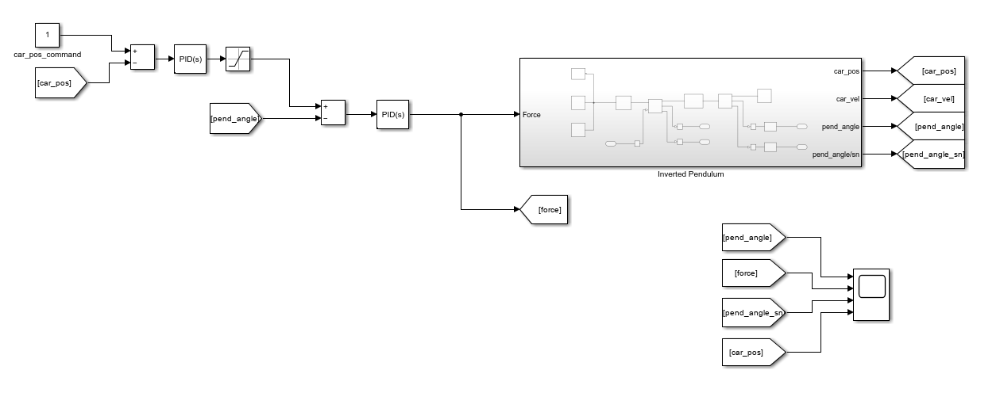
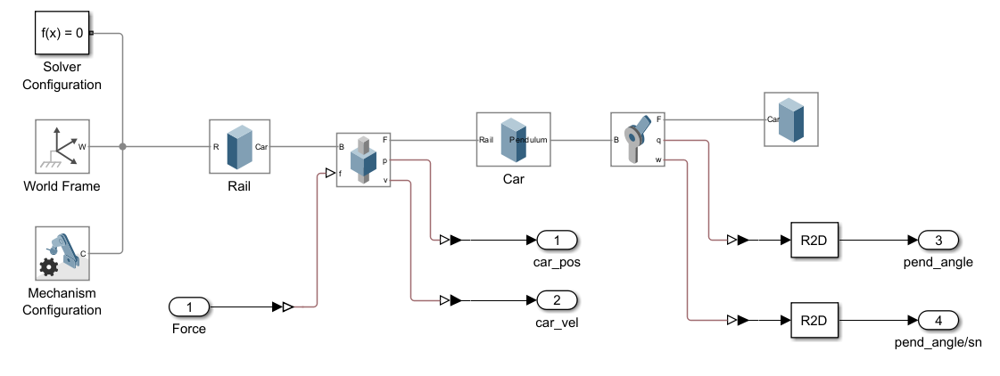
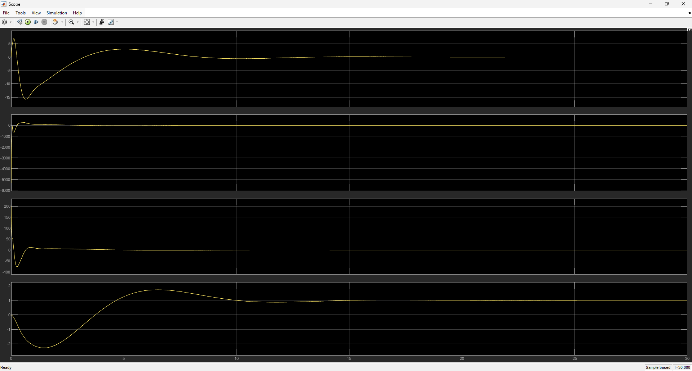

# Inverted Pendulum Control System with PID

A complete modeling, dynamic simulation, and closed-loop PID control design for an **Inverted Pendulum on a Cart** using MATLAB, Simulink, and Simscape Multibody.

---

## 1. What is an Inverted Pendulum?

An **inverted pendulum** is an inherently non-linear, underactuated, and open-loop unstable dynamical system. Unlike a regular pendulum that hangs downward in a stable equilibrium, an inverted pendulum has its center of mass above its pivot point. 

The primary control challenge is to apply an appropriate horizontal control force $F(t)$ to the cart to keep the pendulum balanced vertically upright ($\theta = 0$) while simultaneously maneuvering the cart to a commanded position ($x$).

---

## 2. What is PID Control?

A **Proportional-Integral-Derivative (PID)** controller is a feedback control loop mechanism widely used in industrial control systems. It continuously calculates an error value $e(t)$ as the difference between a desired setpoint $r(t)$ and a measured process variable $y(t)$:

$$e(t) = r(t) - y(t)$$

The control output $u(t)$ is computed using the standard parallel form:

$$u(t) = K_p \, e(t) + K_i \int_{0}^{t} e(\tau) \, d\tau + K_d \, \frac{de(t)}{dt}$$

Where:
- **$K_p$ (Proportional Gain):** Produces an output proportional to the current error magnitude to reduce rise time.
- **$K_i$ (Integral Gain):** Accumulates past errors over time to eliminate steady-state error.
- **$K_d$ (Derivative Gain):** Predicts future error trends based on its rate of change to improve damping and transient stability.

In this architecture, a **Dual-Loop (Cascade) PID structure** is implemented:
1. **Outer Loop (Cart Position PID):** Compares commanded position with actual cart position to generate the target tilt angle.
2. **Inner Loop (Pendulum Angle PID):** Rapidly stabilizes the pendulum angle and outputs the required actuator force $F(t)$.



---

## 3. System Modeling

The physical mechanics of the rail, cart, and pendulum body are modeled using **Simscape Multibody**:

- **World Frame & Solver:** Defines global spatial references and gravity vector.
- **Prismatic Joint (Rail to Cart):** Constrains cart motion to a single translational axis ($x$).
- **Revolute Joint (Cart to Pendulum):** Allows single-axis rotational freedom ($\theta$).
- **Actuation & Sensing:** Translates the input Force ($F$) to cart linear acceleration and outputs cart position ($x$), cart velocity ($\dot{x}$), pendulum angle ($\theta$), and angular velocity ($\dot{\theta}$).



---

## 4. Simulations and Results

The closed-loop system was simulated under a unit step position command ($x_{\text{cmd}} = 1\text{ m}$).



### Key Observations:
- **Pendulum Stabilization:** The pendulum angle quickly counter-steers to accelerate the cart, then settles back to the upright equilibrium position ($0^\circ$) without divergence.
- **Cart Position Tracking:** The cart achieves the commanded $1\text{ m}$ target position smoothly with minimal overshoot and settles within stable bounds.
- **Actuator Effort:** The generated control force remains bounded and dissipates to zero once equilibrium is reached.

---

## 🚀 Getting Started

1. Clone the repository:
   ```bash
   git clone [https://github.com/eminmctt/Inverted-Pendulum.git](https://github.com/eminmctt/Inverted-Pendulum.git)
   cd Inverted-Pendulum